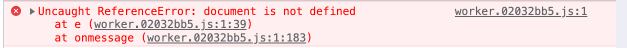

# `import.meta.url` bug in web workers in production builds
It seems that vite doesn't properly replace `import.meta.url` in web workers production builds. In dev mode there is no issue

## Reproducer
To reproduce run:

```
npm run build && npm run preview
```

If you open [http://localhost:4173/](http://localhost:4173/) and then the console you should see:


As you can see vite seems to replace `import.meta.url` with something containing `document` however `document` is not available from web workers.

## Explanation
The entrypoint `main.js` is as below:

```javascript
const worker = new Worker(new URL('./worker.js', import.meta.url), { type: "module" });
worker.postMessage('');
worker.addEventListener('message', (msg) => {
    console.log('message', msg.data);
})
```
All it does setup and invoke a worker from `./worker.js`:

```javascript
import { getImportMetaURL } from "./get-import-meta-url";

onmessage = (e) => {
    postMessage(getImportMetaURL());
}
```

Which tries to post a message back that contains `import.meta.url`. `get-import-meta-url.js` is as follows:

```javascript
export function getImportMetaURL() {
    return import.meta.url;
}
```

## Why is this an issue?
It's an issue because standard ways of importing WASM modules require `import.meta.url`. It's also fairly common to invoke WASM code from a web worker.